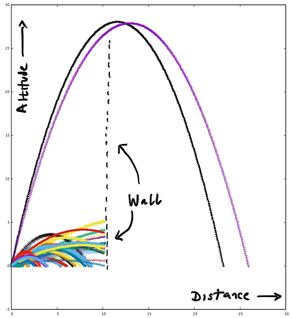
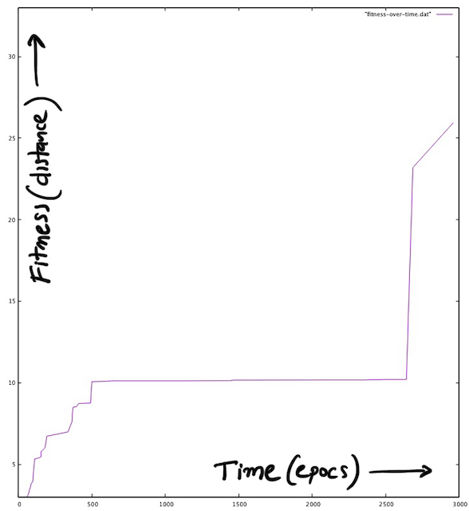

# Canonball Firing Plan GA

Evolves a cannonball firing plan to clear an invisible 25m wall, 10m away.

The evaluation function takes an initial velocity and angle (the firing plan) and computes
the distance covered before hitting the ground (or the wall).

An example run might evolve through the following trajectories:

The two large purple and black trajectories are the ones evolved later.

Plotting the fitness over time shows the algorithm improvement stopping as the trajectories improve enough to reach, but not clear, the wall:

This is all based on the exercise in [Genetic Algorithms and Machine Learning for Programmers](https://pragprog.com/book/fbmach/genetic-algorithms-and-machine-learning-for-programmers).

